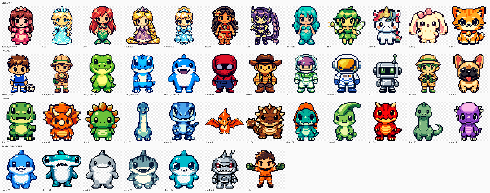
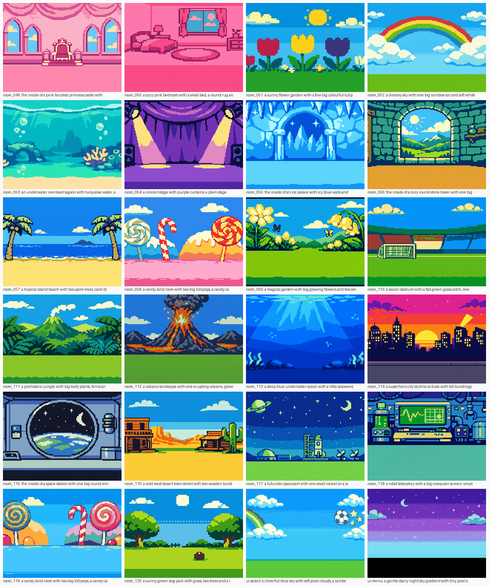

# Pocket Buddy

A pocket-sized buddy game for small kids on the [M5Stack Fire](https://docs.m5stack.com/en/core/fire_v2.7): a Tamagotchi-style character to feed and play with, real-world chores that earn coins, a get-dressed timer, dog walks measured by the built-in motion sensor, missions to do with Dad, a shop, a collection book and eight mini-games. Three buttons, minimal reading, fully offline. I built it for my two, Hugo and Stella, and it boots with the title HUGO + STELLA.



## What's in it

- **Two profiles**, completely separate: coins, buddy, inventory, tasks, missions, maths level.
- **Buddy** with hunger, happiness and energy that drift down over runtime. It never dies and nothing is ever taken away.
- **Tasks**: five daily chores (get dressed, walk the dog, put pyjamas away, brush teeth, pack away toys). Trust based: the kid holds the middle button for two seconds to claim.
- **Get Dressed timer**: 60 seconds with an animated hourglass and a plus-30 option.
- **Walk Frankie**: the dog walks while the device is moving (MPU6886 accelerometer). About five minutes of movement completes the walk, with discoveries along the way.
- **Dad Missions**: 30 real-world missions ("find something red", "do ten big jumps"), three rewarded a day.
- **Daily missions**: three a day per profile, drawn from an audience-filtered pool.
- **Shop and collection book**: 127 catalogue items (characters, accessories, clothes, toys, rooms, treats), plus dinosaurs, sharks, jelly beans, discoveries and badges to collect.
- **Eight games**: Bubble Pop, Colour Match, Penalty Kick, Maths (adaptive, five levels), Find the Dinosaur, Princess Dance, Roller Coaster (tilt) and Shark Swim (tilt).
- **Pixel art**: 45 character and collectible sprites at 48x48, 35 UI icons and 24 room backgrounds in a Game Boy Color style, all generated with OpenAI's image model and quantised by the pipeline in `tools/`.



## Hardware

- M5Stack Fire, tested on v2.7. ESP32 with 16MB flash and 8MB PSRAM, 320x240 LCD, three buttons, MPU6886 IMU, speaker and battery. Nothing else is needed.
- A USB-C data cable. The Fire uses a CH9102 USB serial chip. Recent macOS and Linux need no driver; Windows may need the [CH9102 driver](https://docs.m5stack.com/en/download).
- Other M5Stack Core boards would need a different `board` in `platformio.ini` and a partition table to suit. The code only depends on M5Unified.

## Install

You need Git, Python 3 and [PlatformIO Core](https://docs.platformio.org/en/latest/core/installation/index.html). The VS Code PlatformIO extension works too; the commands below are the CLI.

```bash
pip install platformio
```

```bash
git clone https://github.com/CosmoBlk/stella-game.git
cd stella-game
```

Build the firmware. The first run downloads the ESP32 toolchain and M5Unified, which takes a few minutes.

```bash
pio run
```

Plug the Fire in and flash it. PlatformIO finds the serial port itself. If you have more than one serial device attached, add `--upload-port /dev/cu.usbserial-XXXX` (or `COM5` on Windows).

```bash
pio run -t upload
```

Flash the room backgrounds. This writes `data/` to the device's LittleFS partition. You need it once on a fresh device and again after changing art. It wipes the save file, so don't run it on a device the kids have progress on.

```bash
pio run -t uploadfs
```

Watch the serial log if you want to see what the device is doing.

```bash
pio device monitor
```

The device boots to WHO'S PLAYING? with both profiles on 20 coins.

## Controls

- A = left or previous, B = confirm, C = right or next.
- Hold B for about a second = back. Hold B for two seconds on a task = claim it.
- Hold A and C together = switch player.
- The home screen is one carousel. C scrolls right through the games. A scrolls left through the buddy actions (room, dress up, jelly beans, sleep, play, feed), a MENU card and the tasks. B opens the card. Long B opens the main menu.
- Tilt games: tilt to steer, B pauses.

## Make it your own

- Kid names: `src/screens/PlayerSelectScreen.cpp`, `src/screens/HomeScreen.cpp`, `src/screens/BootScreen.cpp` and `src/DebugConsole.cpp`. The `PlayerId` enum can stay as it is.
- Tasks, dad missions, daily mission pool, items and prices: `src/Content.cpp`. `ACTIVE_TASKS` picks which five tasks show on the home carousel. Item ids are frozen in `CATALOG.md`; add new ones at the end.
- Timers, decay rates, coin values and power saving: `src/Config.h`.
- The dog: Frankie is a French bulldog. Rename the strings in `src/screens/FrankieWalk*.cpp` and `src/Content.cpp`, and regenerate the sprite (see below).

## Debug console and on-device QA

The firmware always compiles in a serial debug console at 115200 baud. Single characters over USB serial inject input and dump state, which is how the QA suites drive the real device.

| Key | Action |
|---|---|
| `a` `b` `c` | short press A, B, C |
| `A` `B` `C` | long press |
| `x` | A and C together |
| `h` | two-second hold of B (task claim) |
| `w` | fake ten seconds of movement |
| `s` | dump the active profile |
| `d` | force a daily reset |
| `t` | advance the pseudo-clock one hour |
| `g` | grant 100 coins |
| `z` | shorten the power-saving timers |
| `i` | print the current screen id |
| `r` | factory reset |
| `0` `1` `2` | volume off, quiet, normal |
| `H` `D` `F` `M` `K` `G` `E` `O` `L` `T` | jump straight to a screen: home, dad missions, Frankie walk, daily missions, collection, games menu, character select, accessory select, clothing select, get dressed timer |
| `?` | help |

The QA harness runs scripted walkthroughs against the device and checks the serial log. Six suites, 236 assertions. Every suite factory-resets the save first, so don't run them on a device with progress on it.

```bash
python3 -m pip install pyserial
```

```bash
python3 tools/qa_walkthrough.py --script smoke
```

Suites: `smoke`, `deep`, `games`, `phase2`, `final`, `battery`. The harness picks the first USB serial device it finds. Override with `--port` or the `POCKET_BUDDY_PORT` environment variable. Output is appended to `qa_log.txt`.

## Regenerating the art

`tools/gen_sprites.py` generates sprites, kid tiles, UI icons and room backgrounds through the OpenAI image API, quantises them to small palettes, and emits the C arrays in `src/Assets*` and `src/IconsData.h` plus the `.bin` backgrounds in `data/`. It needs Pillow and an `OPENAI_API_KEY` in the environment. Every generated image costs money, so the script skips anything that already has a source PNG unless you pass `--force`.

```bash
python3 -m pip install pillow
```

```bash
python3 tools/gen_sprites.py --help
```

`SPRITE_NOTES.md` covers the prompt style, the quantisation rules and what went wrong the first time round.

## Layout

- `src/` core: `App` (screen state machine and event funnel), `Input`, `Audio` (synthesised tones), `Save` (atomic CRC-checked saves on LittleFS), `Clock` (daily reset without a real-time clock), `Power`, `Gfx` (one PSRAM canvas pushed per frame), `Bg` (streamed backgrounds), `Missions`, `Buddy`.
- `src/screens/` the screens and `src/games/` the eight games. Each registers itself; see `ARCHITECTURE.md`.
- `src/Content.cpp` the whole catalogue: items, tasks, dad missions, daily mission pool, dinosaurs, sharks, jelly beans.
- `src/Sprites.cpp` bitmap blitter plus procedural fallbacks for anything without a bitmap.
- `data/` the LittleFS image: room and UI backgrounds as 160x120 RGB565.
- `assets/` source PNGs, quantised PNGs and preview montages.
- `tools/` the art pipeline and the QA harness.
- `SPEC.md` the full game brief. `ARCHITECTURE.md` conventions and contracts. `CATALOG.md` frozen item ids. `SPRITE_NOTES.md` art pipeline notes.

## Design rules

These are deliberate. Keep them if you fork it for your own kids.

- The buddy never dies. No punishments, no coin loss, no streaks to break, no dead ends. Everything is recoverable with the three buttons.
- Every carousel and menu opens at the first position, so a four-year-old can predict what a button will do.
- All profile mutations go through the event funnel in `App::raiseEvent`. Screens never bump totals directly.
- Purchases debit coins once and only save after the item is granted, so a battery pull can't eat coins.
- Save writes are atomic: temp file, verify, back up, rename. Progress survives battery loss.
- Nothing scary. Sharks are friendly, and wrong answers get "GOOD TRY!" and a retry.

## Licence

The code is MIT, see `LICENSE`.

The sprites were generated with OpenAI's image model. Several of the character sprites and catalogue names are recognisable takes on characters owned by Disney, Pixar, Marvel and Sony (Elsa, Ariel, Rapunzel, Cinderella, Moana, Rumi, Spider-Man, Woody, Buzz). They exist because that is what my kids asked for. They are not covered by the MIT licence. If you do anything with this beyond a device for your own family, replace them; the pipeline in `tools/gen_sprites.py` makes that a one-line prompt change per sprite.
